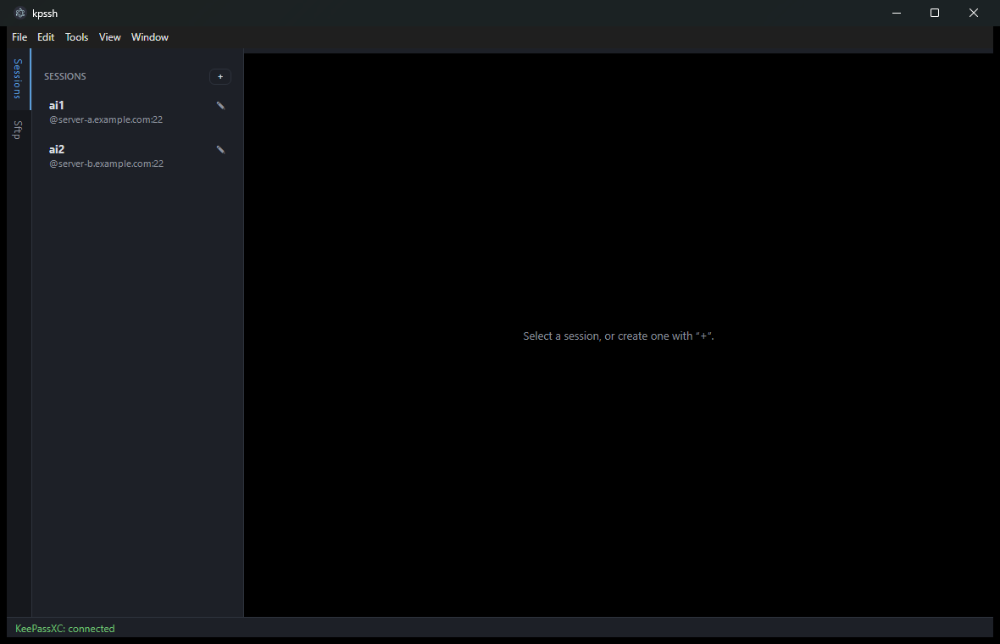

# kpssh

A small SSH/SFTP client (Electron) that pulls credentials from a
**running, unlocked KeePassXC** via its browser-integration protocol — your
master password never touches this app.

📖 **[Usage guide with screenshots →](docs/USAGE.md)**



## Features
- Session manager (host / port / user / auth method), tabbed terminals (xterm.js)
- Integrated **SFTP browser**: drag-and-drop upload, recursive folder up/download,
  transfer progress, multi-select, rename/delete/mkdir, right-click menu
- **Remote file editor** — double-click a file to edit it in place and save back
- **SSH tunnels** (local/remote port forwarding) per session
- **Jump host** (gateway / `ssh -J`) per session
- **Multi-exec** — broadcast keystrokes to all connected sessions
- **Macros** — named command snippets, run from the menu
- **Global aliases** — applied to every shell on connect
- **Syntax highlighting** of terminal output (global + per-host, toggleable)
- **Configurable data directory** (Tools → Settings)
- Three auth methods, all backed by KeePassXC:
  - **KeePass — password**: password fetched live via `get-logins`
  - **KeePass — private key**: PEM key read from a custom string field
  - **SSH agent**: keys served by the KeePassXC SSH agent
- Create/update KeePassXC entries (username + password) directly from the app

## Requirements
- Node.js 18+ (to run from source or build)
- KeePassXC with **Browser Integration enabled**
  (Tools → Settings → Browser Integration → "Enable browser integration";
  no specific browser checkbox is required).

## Run
```bash
npm install
npm start
```
On first credential lookup KeePassXC shows a pairing dialog — give the
connection a name and allow it. The association is stored under the data
directory and reused afterwards.

## Build a standalone Windows executable
```bash
npm run dist:portable    # single-file dist/kpssh-<version>-portable.exe
npm run dist:installer   # NSIS setup.exe
npm run pack             # unpacked folder (dist/win-unpacked)
```
Tagged releases (`vX.Y.Z`) build a portable `.exe` automatically via GitHub
Actions and attach it to the release.

## How auth works

### Password / private key (browser protocol)
KeePassXC matches `get-logins` against the **URL field** of entries only (never
custom fields). It accepts non-http(s) schemes as long as both sides use the
same one, so kpssh derives the lookup URL from the session host as
`ssh://<host>`. Leave "KeePass match URL" blank and put that URL on the entry:
- the entry's **URL** field, or
- **Additional URLs** (entry → Browser Integration) if it already has a URL.

Two caveats from the matching logic:
- Use an **FQDN** (host containing a dot). Short names get priority 0 and are
  dropped when "best match only" is on. `localhost` is exempt.
- Don't put a port in the KeePass URL unless it must match exactly.

A custom field such as `hostname` cannot be used for matching — the protocol
has no entry-enumeration call, so matching is URL-only.

- **Password**: taken from the entry's password field.
- **Private key**: the protocol does **not** expose file attachments, so store
  the PEM key in a custom string field. In KeePassXC: entry → Advanced → add
  attribute `privateKey` with the PEM contents. The app reads `KPH: privateKey`
  (field name configurable per session). Passphrase: a second string field, or
  blank to use the entry password.

### SSH agent
If your keys live in KeePassXC as KeeAgent attachments, enable the KeePassXC
**SSH Agent** (Settings → SSH Agent) and pick auth method "SSH agent". On
Windows the default path is `\\.\pipe\openssh-ssh-agent` (KeePassXC "Use OpenSSH
for agent"); for Pageant set the agent path to `pageant`.

## Layout
```
src/
  main.js       Electron main: window, KeePass orchestration, SSH/SFTP/tunnel IPC
  preload.js    contextBridge API
  keepass.js    KeePassXC browser-integration protocol client (NaCl)
  ssh.js        ssh2 wrapper (shell + SFTP + jump host)
  sessions.js   JSON persistence (sessions, aliases, macros, settings, association)
renderer/
  index.html / styles.css / renderer.js
```

## Data storage
All state lives as JSON in the data directory (default: Electron userData,
changeable via Tools → Settings):
`sessions.json`, `aliases.json`, `macros.json`, `settings.json`,
`keepass-association.json` (each mode `0600`).

## Security notes
- The association private key is the keying material for credential access;
  it is stored in `keepass-association.json` (mode 0600). Treat it like a
  key file.
- Credentials are only retrievable while KeePassXC is unlocked.
- `contextIsolation` is on and `nodeIntegration` is off; the renderer talks to
  Node only through the preload bridge.

## Not yet included (natural next steps)
- Host key verification UI (ssh2 verifies via `hostVerifier` — add a callback)
- Encrypting the association file at rest
- Cancelling individual in-flight transfers
