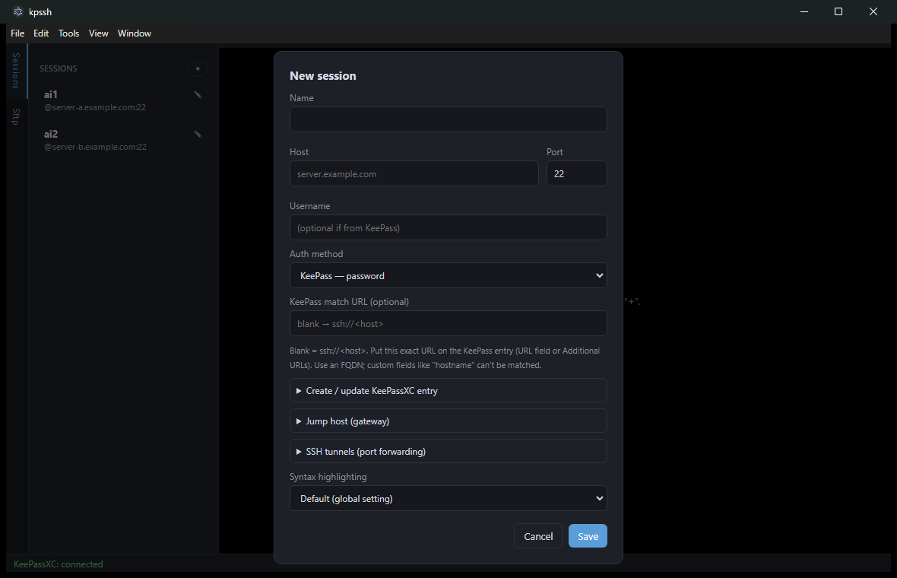

# kpssh — Usage guide

A short walkthrough of the everyday workflow. For the credential/KeePassXC
details see the [README](../README.md).

## 1. Start

Run the portable build (`kpssh-<version>-portable.exe`) or, from source,
`npm start`. The footer shows the KeePassXC status — green **connected** means
the running, unlocked database is reachable. If it shows an error, click
**Pair** (or `Tools → Pair with KeePassXC`) and confirm the dialog in KeePassXC.

On the far left are the vertical tabs **Sessions** and **Sftp**. The Sessions
pane lists saved connections; the footer carries the KeePassXC status.

## 2. Create a session

Click **+** in the Sessions pane (or the pencil ✎ to edit an existing one).

- **Host / Port / Username** — the target. Username may stay empty if it comes
  from KeePassXC.
- **Auth method**:
  - *KeePass — password* — password fetched live via the browser protocol
  - *KeePass — private key* — PEM key from a `KPH:` custom string field
  - *SSH agent* — keys served by the KeePassXC SSH agent
- **KeePass match URL** — leave blank to use `ssh://<host>`; put that exact URL
  on the KeePassXC entry (URL field or *Additional URLs*).
- **Create / update KeePassXC entry** — type a password here and save it
  straight into KeePassXC (creates an entry with URL = match URL, login =
  username). Handy for first-time setup.
- **Jump host (gateway)** — connect through a bastion (`ssh -J`).
- **SSH tunnels (port forwarding)** — add local/remote forwards: `srcPort →
  dstHost:dstPort`. They start on connect, stop on disconnect.
- **Syntax highlighting** — per-host override of the global setting.

Click **Save**. Then click the session in the list to connect — a terminal tab
opens and, once connected, the **Sftp** browser pops up for that session.

## 3. Terminal

Each session is a tab. Standard interactive shell (xterm.js). Global aliases
(`Tools → Manage Aliases…`) are applied automatically on connect.

- **Multi-exec** (`Tools → Multi-exec mode`, `Ctrl+Shift+M`): an orange banner
  appears and your keystrokes go to **all** connected sessions at once — useful
  for running the same command across a group of servers.
- **Macros** (`Tools → Macros`): save named command snippets; saved macros show
  up in the same menu and are sent to the active session on click.

## 4. SFTP browser

The **Sftp** edge tab shows the remote filesystem of the active session.

- **Navigate**: double-click a folder; the toolbar has Up / Home / Refresh.
- **Download**: select files/folders → ⬇ (or right-click → Download). Folders
  download recursively; a single file prompts for a save location, multiple
  items prompt for a destination folder.
- **Upload**: ⬆ to pick files, or **drag & drop** from Explorer onto the panel
  (multiple files and whole folders, recursive). A progress strip shows each
  transfer.
- **Edit a remote file**: double-click it (or right-click → Edit) to open it in
  the built-in editor and save back over SFTP.
- **Manage**: right-click for New folder / Rename / Delete.
- **Follow terminal folder**: tick the checkbox to make the browser follow the
  shell's current directory (needs an OSC-7 capable shell).

## 5. Settings

`Tools → Settings…`:
- **Data directory** — where all JSON files live (sessions, aliases, macros,
  settings, KeePassXC association). Default is the app data folder; change it
  with **Browse…** and optionally move the existing files along.
- **Syntax highlighting (global default)** — on/off; per-session overrides win.
